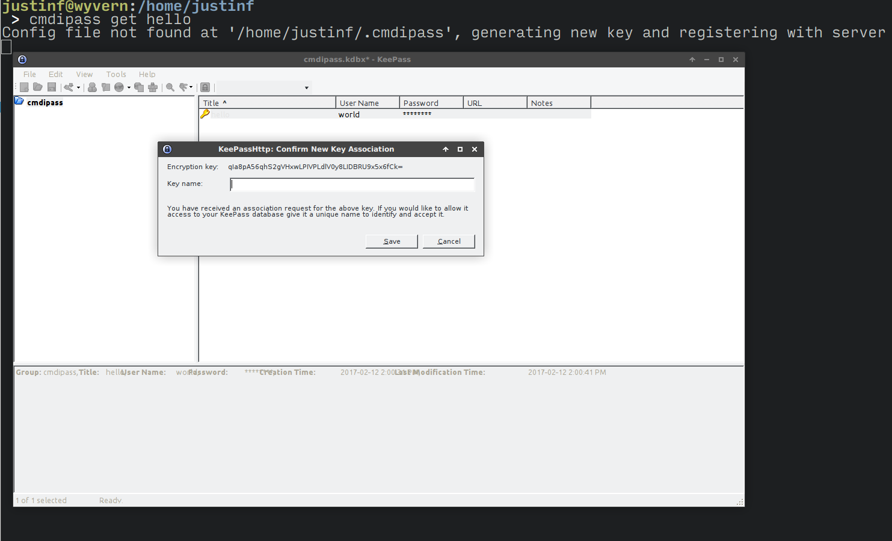

# cmdipass
Command line client for KeePass via the KeePassHttp plugin

## Intro

Copy and pasting secrets to the command line sucks. How about we just pull them out of keepass, and save ourselves the trouble? As a bonus, we still get a useful entry in our shell's history, without leaking the secret.

Before:

```
justinf@wyvern:/home/justinf/src/cmdipass
master ✔ > vault auth -method=github token=redacted1234
Successfully authenticated! You are now logged in.

justinf@wyvern:/home/justinf/src/cmdipass
master ✔ > history | grep github | tail -n 1
10037  vault auth -method=github token=redacted1234
```

After:
```
justinf@wyvern:/home/justinf/src/cmdipass
master ✔ > vault auth -method=github token=$(cmdipass get-one github-token 0 --password-only)
Successfully authenticated! You are now logged in.

justinf@wyvern:/home/justinf/src/cmdipass
master ✔ > history | grep github | tail -n 1
10043  vault auth -method=github token=$(cmdipass get-one github-token 0 --password-only)
```

`cmdipass` uses [KeePassHttp](https://github.com/pfn/keepasshttp) to securely fetch secrets from [KeePass](http://keepass.info/). The first time you execute `cmdipass`, it will attempt to register with KeePassHttp.



From then on, you'll get a notification whenever cmdipass is used to look up a value.

## Usage

```
cmdipass get <search-string>
cmdipass get-one <search-string> <index> [--password-only | --username-only]
cmdipass --version
cmdipass (-h | --help)
```

## Downloads

I haven't published any binary releases yet, but I will soon! Until then, see the [Compiling from source](#compiling-from-source) secton.

## Compiling from source

You'll need rust. I recommend using [rustup](https://www.rustup.rs/) to get it, although you may want to use an [alternative installation method](https://github.com/rust-lang-nursery/rustup.rs/#other-installation-methods) to avoid the `curl | bash` anti-pattern.

Then, just clone the repo and run `cargo build` from the root of the repo. Your executable will be available at `target/debug/cmdipass`. Debug build recommended since performance is not a significant factor and it'll help you submit a useful bug report when something goes wrong. :smile:

## Contributing

Happy to accept issues and pull requests.

## Contact

Chat with me on keybase or one of the other accounts I've verified: https://keybase.io/jsfitzsimmons/
